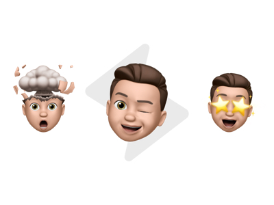

# WWDC20 Swift Student Challenge submission

## About the playground

The idea behind this playground is to help people who are experiencing problems with writing. This mainly concerns children in primary school or people like my father. He, like many others, suffers from multiple sclerosis, an autoimmune disease. Above all he has immense difficulties with writing.
In order to help him and many others, I have chosen Machine Learning, since it's the only way to make computers our assistants.

To be able to use Machine Learning in the playground, I created the model for Vision from scratch to integrate it into the interface later. This was the most extensive but also the most fun part of the playground. Vision was used to be able to use the model in the LiveViews.

The LiveView itself uses the standard UI framework for iOS and tvOS, UIKit together with Auto Layout to make the interface nice and smooth. The design has always played an essential role.

To further enhance the user experience, AVFoundation is also used. It gives feedback after an interaction is completed. And let's be honest, a bold interface along with sounds is just beautiful to interact with.

When you go to the second page, there is the possibility to train the handwriting in order for the model to better predict the given characters. On this page, you'll learn a lot about the technology behind Machine Learning.

One page further, you will come across the game. It offers you the opportunity to apply the training from the previous page. A word is given to you, which you write into the fields one by one. If you have done everything correctly, you will receive 5 points. Of course you can empty the canvas or get a new word.

In summary, the playground shows the possibilities that can be achieved with Machine Learning and the other Apple technologies and what incredible magic is behind it.

## How to use it

If you'd like to give it a try, simply send the .playgroundbook file over to your iPad or Mac and open it with the Playgrounds app. Have fun while using!
